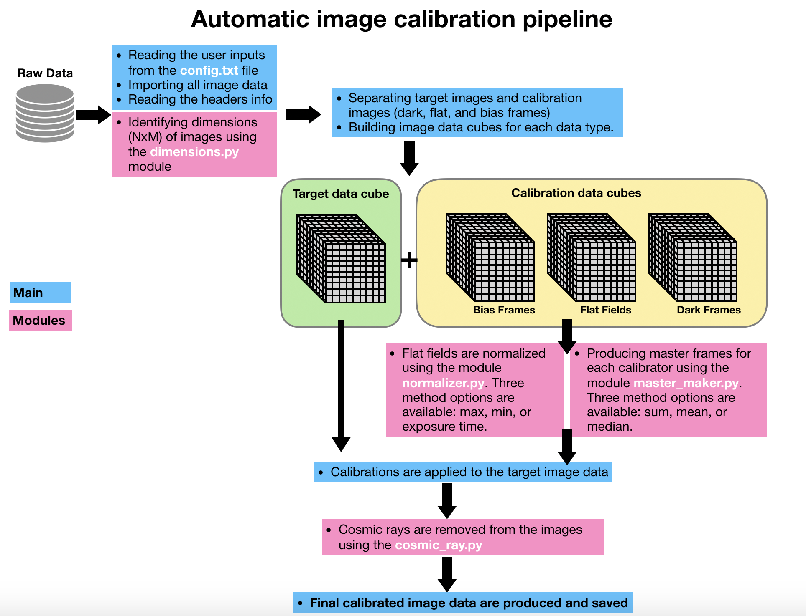

# Automatic Data Reduction Pipeline
Fast and automatic data reduction pipeline for small optical telescopes data.

In optical astronomy, data reduction is referred to the various processes performed on raw images in order to calibrate and prepare them for scientific analysis. Read more here: https://behnamjavanmardi.com/data-tools/data-reduction-pipeline/

Start with modifying the config.txt file based on your data.
